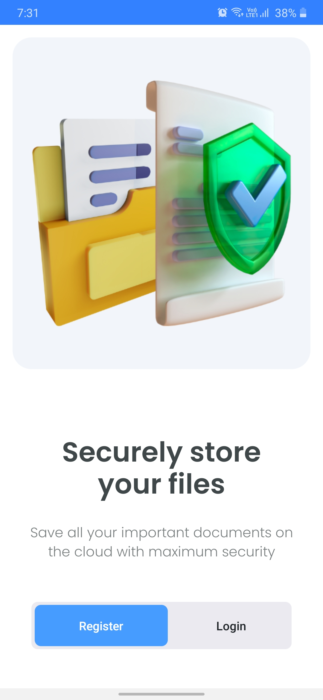
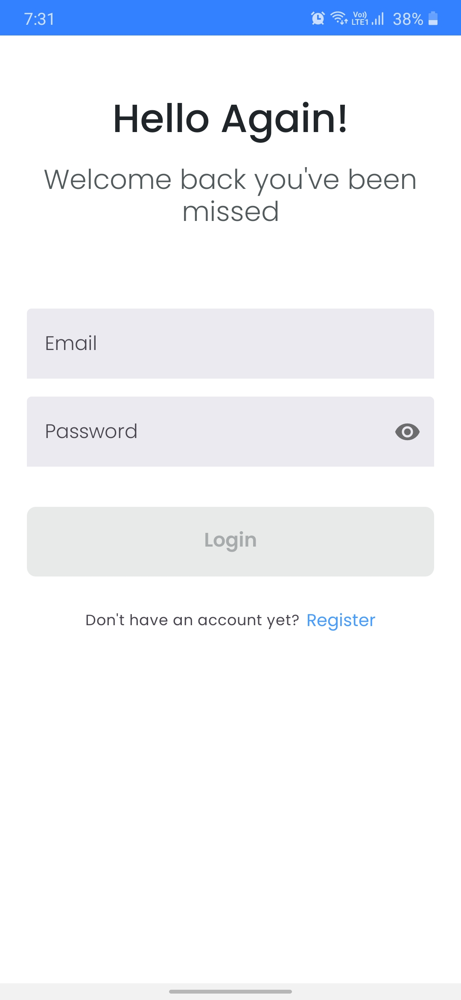
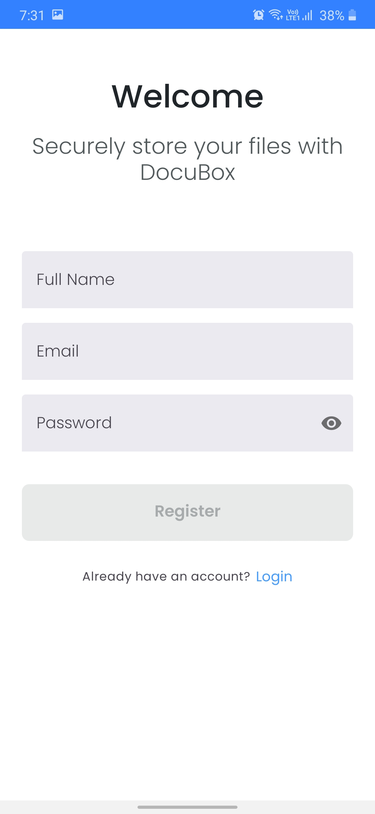
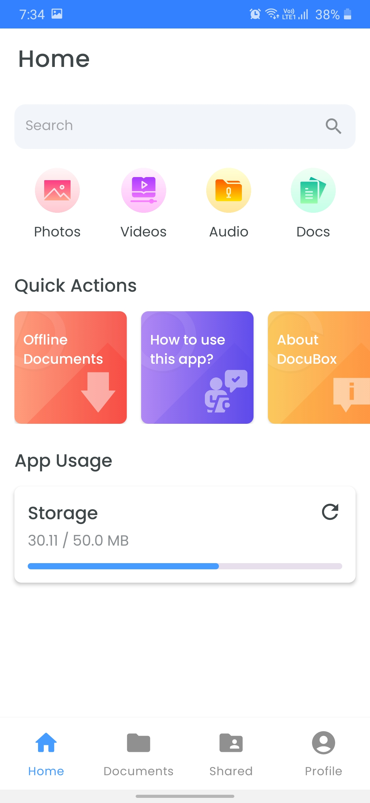
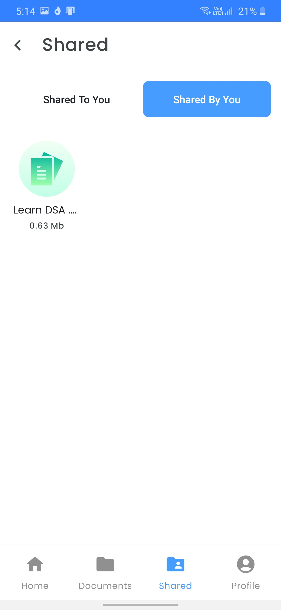
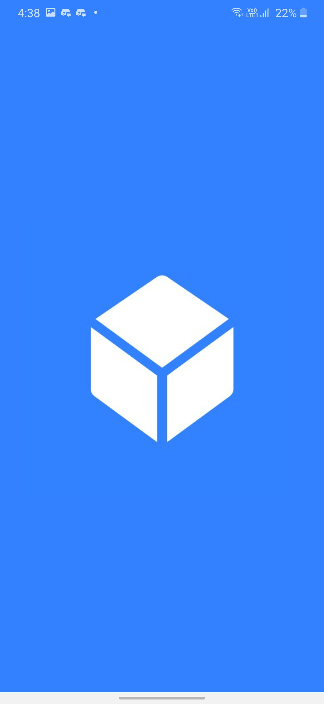

# **DocuBox** 

**DocuBox** is a cloud based file storing android app where you can securely store and access your documents from anywhere around the world!

# Application Install

***You can install the latest version of DocuBox app from the link given below 👇***

[](https://github.com/Vaibhav2002/DocuBox-AndroidApp/releases/tag/v1.0.0)

## About

Using DocuBox, one can create an account, upload their files, view them on cloud or download them and also share them with their friends and colleagues. All the files uploaded by the users are stored in an encrypted format.

### Technical details

- The frontend of DocuBox is an android app which is written using Kotlin. It follows MVVM architecture, SOLID and MAD principles, and other best practices for clean and scalable code. To learn more about the android part of this app, you can refer to the Android Repository of DocuBox

- The backend of DocuBox is built using the power of Nodejs, Expressjs and MongoDb! It follows MVC architecture, DRY code principles and uses EJS as a templating engine. Currently, the backend part is deployed on Linode, which is a popular cloud service provider platform for deploying your backend and database!

## Setup [Android App]
- Clone the [Android Repository](https://github.com/ishantchauhan710/DocuBox) of DocuBox on your computer.
- Create Secrets.kt file in app/src/main/java/com/docubox/util folder and there, write:

```kotlin
const val BASE_URL = "http://[your server url]/api/"
```
[your server url] is the url where your backend is deployed. You can get it from your cloud hosting provider platform like Linode, Digital Ocean or Amazon Web Services.


## Setup [Backend]
To setup this project, you will need a cloud hosting service provider like Linode, Digital Ocean or Amazon Web Services. Once you get the account, you need to configure a server where your backend will run on. For this project, I have used an ubuntu server however, you can go with any server you are comfortable with. Once you are done with this, follow the following steps to setup the backend of this project!

1. Install the following tools on your server: nodejs, npm, git, ufw, mongodb.
2. Once done, open the ports for http and https on your server. You can use ufw tool to do so.
3. Start the mongodb service and also check its status
4. Create an object storage on your hosting account named "docubox"
5. Clone this repository on your server

```
git clone https://github.com/ishantchauhan710/DocuBox
```
6. In the root folder of the repository, create a file named ".env" and there, write:

```
MONGO_URL=mongodb://127.0.0.1:27017/docubox
PORT=XXXX
JWT_SECRET=XXXXXXXX
STORAGE_ACCESS_KEY=XXXXXXXX
STORAGE_SECRET_KEY=XXXXXXXX
STORAGE_BUCKET=XXXXXXXX
STORAGE_REGION=XXXXXXXX
STORAGE_URL=XXXXXXXX
ENCRYPTION_KEY=XXXXXXXX
SIGNATURE_KEY=XXXXXXXX
```

- Here, MONGO_URL is the url where your mongodb service will run on. Since we will be running it on the server itself and our nodejs server will communicate using it, we have assigned the localhost url to the MONGO_URL variable

- Assign any value to the PORT. It is the port on which your nodejs server will run on.

- JWT_SECRET is the secret variable that will be used to encrypt the user passwords. You can assign it with any value you want.

- STORAGE_ACCESS_KEY, STORAGE_SECRET_KEY, STORAGE_BUCKET, STORAGE_REGION and STORAGE_URL are the variables that refer to the object storage of your hosting. An object storage is the place where the actual files of the users will get stored. You can easily get their values by refering to your hosting provider's manual.

- ENCRYPTION_KEY will be used to encrypt the files of the user. You can use a base 64 generator and assign it with any 32 bytes base64 value.

- SIGNATURE_KEY will be used to sign the encryption key. In encryption, a signature is a proof that the user has the private key which matches with some public key. You can use a base 64 generator and assign it with any 64 bytes base64 value.

7. Once done, in terminal, install all the essential nodejs packages mentioned in package.json file using the following commpand:

```
npm install
```

8. Lastly, you need to somehow enable the your linux server to listen to the http/https requests and transfer them to your nodejs server's port. You can use a reverse proxy or any tool like nginx or apache to do so. However, for testing, you can simply open your nodejs port publically using ufw and make requests to that port!

9. And then, you can finally start the nodejs server using the following command:
```
npm start
```
10. Check the terminal to ensure if the nodejs server is running fine. You can then make use of any tool like POSTMAN to test the API requests!


### App Features

- **User Authentication** - Supports email based authentication
- **Saving Files** - You can upload your files to DocuBox's cloud storage and access it anywhere.
- **File Encryption** - Files stored on DocuBox is secure and encrypted, so your data is securely stored.
- **Sharing File Access** - You can share view access of your files to other users.
- **File Management** - You can create multiple folders to organize your storage just as you want it.
- **File Download** - You can even download your files and save them locally for offline access.
- **Enhanced File Search** - Super fast file searching which can search files instantly.

## 📸 Screenshots 

|   |   |   |
|---|---|---|
||  | 
| |  | 
|| | 
| |  | 

### Insights into the app 🔎

<!-- Place all mockups and banners here -->


## Built With 🛠
- [Kotlin](https://kotlinlang.org/) - First class and official programming language for Android development.
- [Coroutines](https://kotlinlang.org/docs/reference/coroutines-overview.html) - For asynchronous and more..
- [Flow](https://kotlin.github.io/kotlinx.coroutines/kotlinx-coroutines-core/kotlinx.coroutines.flow/-flow/) - A cold asynchronous data stream that sequentially emits values and completes normally or with an exception.
 - [StateFlow](https://developer.android.com/kotlin/flow/stateflow-and-sharedflow) - StateFlow is a state-holder observable flow that emits the current and new state updates to its collectors.
 - [SharedFlow](https://developer.android.com/kotlin/flow/stateflow-and-sharedflow) - A SharedFlow is a highly-configurable generalization of StateFlow.
- [Android Architecture Components](https://developer.android.com/topic/libraries/architecture) - Collection of libraries that help you design robust, testable, and maintainable apps.
  - [ViewModel](https://developer.android.com/topic/libraries/architecture/viewmodel) - Stores UI-related data that isn't destroyed on UI changes. 
  - [ViewBinding](https://developer.android.com/topic/libraries/view-binding) - Generates a binding class for each XML layout file present in that module and allows you to more easily write code that interacts with views.
  - [DataBinding](https://developer.android.com/topic/libraries/data-binding) - Binds data directly into XML layouts
  - [Room](https://developer.android.com/training/data-storage/room) - Room is an android library which is an ORM which wraps android's native SQLite database
  - [DataStore](https://developer.android.com/topic/libraries/architecture/datastore) - Jetpack DataStore is a data storage solution that allows you to store key-value pairs or typed objects with protocol buffers.
- [Dependency Injection](https://developer.android.com/training/dependency-injection) - 
  - [Hilt-Dagger](https://dagger.dev/hilt/) - Standard library to incorporate Dagger dependency injection into an Android application.
  - [Hilt-ViewModel](https://developer.android.com/training/dependency-injection/hilt-jetpack) - DI for injecting `ViewModel`.
- [GSON](https://github.com/google/gson) - A modern JSON library for Kotlin and Java.
- [Timber](https://github.com/JakeWharton/timber) - A simple logging library for android.
- [Retrofit](https://square.github.io/retrofit/) - A type-safe HTTP client for Android and Java.
- [GSON Converter](https://github.com/square/retrofit/tree/master/retrofit-converters/gson) - A Converter which uses Moshi for serialization to and from JSON.
- [Coil](https://github.com/coil-kt/coil) - An image loading library for Android backed by Kotlin Coroutines.
- [Material Components for Android](https://github.com/material-components/material-components-android) - Modular and customizable Material Design UI components for Android.

# Package Structure
    
    com.docubox             # Root Package
    .
    ├── data                # For data handling.
    |   ├── local           # Local Datasource and classes
    |   ├── remote          # Remote datasources and API Service
    │   ├── model           # Model data classes and mapper classes, both remote and local entities
    │   └── repo            # Single source of data.
    |
    ├── service             # Foreground Service to upload File to server
    |
    ├── di                  # Dependency Injection             
    │   └── module          # DI Modules
    |
    ├── ui                  # UI/View layer
    |   ├── adapters        # Adapter, ViewHolder and DiffUtil
    |   └── screens         # All App Screens 
    |
    └── utils               # Utility Classes / Kotlin extensions


## Architecture
This app uses [***MVVM (Model View View-Model)***](https://developer.android.com/jetpack/docs/guide#recommended-app-arch) architecture.


  


---

## If you like my projects and want to support me to build more cool open source projects
  
<a href="https://www.buymeacoffee.com/VaibhavJaiswal"></a>

---

 ## Contact
If you need any help, you can connect with me.

Visit:- [Vaibhav Jaiswal](https://vaibhavjaiswal.vercel.app/#/)
  


