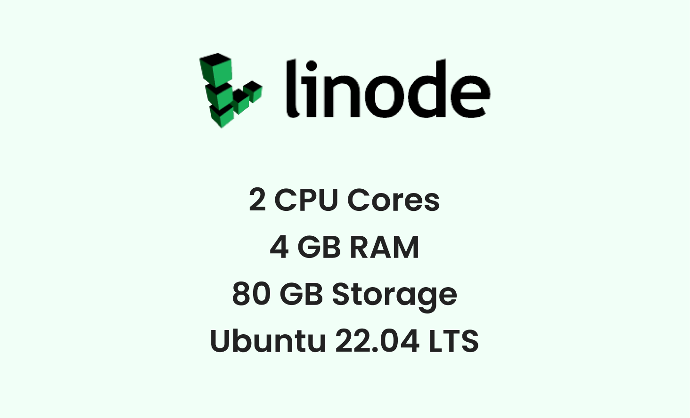

# **DocuBox** 

**DocuBox** is an app where you can securely upload your files on the cloud – from family pictures and audio recordings to spreadsheets, presentations and other confidential documents. All the files uploaded by the users are stored in an encrypted format.

This project is developed by **Team 404** for Hashnode x Linode hackathon. This team comprises of [Ishant](https://github.com/ishantchauhan710/) and [Vaibhav](https://github.com/Vaibhav2002).

## Blog :writing_hand:
To know more about how we built this project, read my article here: <br>
[https://ishantchauhan.hashnode.dev/docubox-securely-store-access-and-share-your-files-on-cloud](https://ishantchauhan.hashnode.dev/docubox-securely-store-access-and-share-your-files-on-cloud)

## About

DocuBox is an open source cloud file storing app. One can upload their files, view them on cloud or download them and also share them with their friends and colleagues. All the files uploaded by the users are stored in an encrypted format.

Here is a short [video](https://www.youtube.com/watch?v=z94j9FA-5oY) on DocuBox

## Application Install

***You can install the latest version of DocuBox app from the link given below 👇***

[](https://github.com/Vaibhav2002/DocuBox-AndroidApp/releases/tag/v1.0.0)

## App Features

- **User Authentication** - Supports email based authentication
- **File Uploading** - You can upload your files on DocuBox and access it from anywhere around the world.
- **File Encryption** - Files stored on DocuBox are stored in encrypted format, so your privacy remains protected.
- **File Sharing** - You can share the access of your files with other users.
- **File Management** - You can create multiple folders to organize your files in the way you want.
- **File Download** - You can download your files and save them locally for offline usage.
- **File Search** - Enhanced file searching which can give results quickly.

## Technical details

- The frontend of DocuBox is an android app which is written using Kotlin. It follows MVVM architecture, SOLID and MAD principles, and other best practices for clean and scalable code.

- The backend of DocuBox is built using the power of Nodejs, Expressjs and MongoDb! It follows MVC architecture, DRY code principles and uses EJS as a templating engine. Currently, the backend part is deployed on Linode, which is a popular cloud service provider platform for deploying your backend and database!

## 📸 Screenshots 

|   |   |   |
|---|---|---|
||  | 
| |  | 
|| | 
| |  | 


## Setup [Android App]
For this, you can refer to the [Android Repository](https://github.com/Vaibhav2002/DocuBox-AndroidApp) of DocuBox to setup the android part of DocuBox

## Setup [Backend]
To setup the backend of this project, you will need a cloud hosting service provider like Linode, Digital Ocean or Amazon Web Services. Once you get the account, you need to configure a server where your backend will run on. For this project, I have used an ubuntu server however, you can go with any server you are comfortable with. Once you are done with this, follow the following steps to setup the backend of this project!

1. Install the following tools on your server: nodejs, npm, git, ufw, mongodb

2. Configure the object storage provided by your hosting provider.

3. Open the http and https port on your server using ufw

4. Clone this repository and navigate to the root folder

5. Create a file named ".env" and there, write:

```
MONGO_URL=mongodb://127.0.0.1:27017/docubox
PORT=XXXX
JWT_SECRET=XXXXXXXX
STORAGE_ACCESS_KEY=XXXXXXXX
STORAGE_SECRET_KEY=XXXXXXXX
STORAGE_BUCKET=XXXXXXXX
STORAGE_REGION=XXXXXXXX
STORAGE_URL=XXXXXXXX
ENCRYPTION_KEY=XXXXXXXX
SIGNATURE_KEY=XXXXXXXX
```

- Here, MONGO_URL is the url where your mongodb service will run on. Since we will be running it on the server itself and our nodejs server will communicate using it, we have assigned the localhost url to the MONGO_URL variable

- Assign any value to the PORT. It is the port on which your nodejs server will run on

- JWT_SECRET is the secret variable that will be used to encrypt the user passwords. You can assign it with any value you want

- STORAGE_ACCESS_KEY, STORAGE_SECRET_KEY, STORAGE_BUCKET, STORAGE_REGION and STORAGE_URL are the variables that refer to the object storage of your hosting. An object storage is the place where the actual files of the users will get stored. You can easily get their values by refering to your hosting provider's manual

- ENCRYPTION_KEY will be used to encrypt the files of the user. You can use a base 64 generator and assign it with any 32 bytes base64 value

- SIGNATURE_KEY will be used to sign the encryption key. In encryption, a signature is a proof that the user has the private key which matches with some public key. You can use a base 64 generator and assign it with any 64 bytes base64 value

6. Now, you need to somehow enable the your linux server to listen to the http/https requests and transfer them to your nodejs server's port. You can use a reverse proxy or any tool like nginx or apache to do so. However, for testing, you can simply open your nodejs port publically using ufw and make requests to that port!

7. Install all the required packages to run the nodejs backend by writing "npm install" command in the root folder

8. Finally start the nodejs backend server using "npm start" command 




## Built With [Backend] 🛠
* [Linode](www.linode.com) - Linode is a popular cloud hosting service provider where you can deploy your backend
* [NodeJS](https://nodejs.org/en/about/) - NodeJS is something that allows you to write javascript code on a server! Traditionally, javascript was only available for frontend design purpose however, with NodeJS, you can use javascript for backend purpose too!
* [ExpressJS](https://expressjs.com/) - ExpressJS is a framework that drastically reduces the amount of backend code we write in NodeJS. It is highly flexible and makes things a lot easier!
* [MongoDB](https://www.mongodb.com/) - MongoDB is a NoSQL Database that unlike SQL, stores data in form of collections!
* [AWS SDk](https://www.npmjs.com/package/aws-sdk) - A software development kit provided by amazon web services, it lets you easily access and manipulate the data stored in your cloud's object storage
* [Multer](https://www.npmjs.com/package/multer) - A middleware for handling multipart/form-data, which is primarily used for uploading files
* [BCryptJS](https://www.npmjs.com/package/bcryptjs) - This is an NPM package that lets you encrypt the passwords before you store them on the server
* [Mongoose Encryption](https://www.npmjs.com/package/mongoose-encryption) - A library that encrypts all the data that is stored in mongodb

## Architecture [Backend]
The backend of DocuBox uses [***MVC (Model View Controller)***](https://en.wikipedia.org/wiki/Model%E2%80%93view%E2%80%93controller) architecture.


## Package Structure [Backend] :open_file_folder:
    
    docubox                 # Root Directory
    .
    ├── backend             # Contains all the nodejs server code
    |   ├── config          # Contains configuration files for jwt token generation, mongoose and multer
    |   ├── controllers     # Contains files with functions that will get executed on specified routes
    │   ├── middlewares     # Contains functions that will be executed before a particular controller, helps in authorization and error handling
    │   ├── models          # Contains files which define the schema or database structure of a particular collection in mongodb
    │   ├── routes          # Defines the API endpoints and the controller function to be called on them
    │   ├── util            # Contains utility files for file management
    │   ├── views           # Contains EJS files which will be shown when a user tries to open an image, video or audio file in the app
    │   └── server.js       # The main nodejs server file which binds everything together and starts the server
    |
    └── package.json        # Contains list of all the libraries / modules required to run the nodejs server


## Database Schemas
#### User Schema   

#### File Schema
 
#### Folder Schema


## Available APIs [Backend] :computer:
The backend of DocuBox provides many different APIs to perform different operations such as file upload, create folder, share folder, view file etc. All the available APIs and their corresponding controllers can be found inside the routes folder.


## Attribution
The project is deployed on [Linode](https://www.linode.com) for the [Hashnode X Linode Hackathon](https://townhall.hashnode.com/build-with-linode-hackathon-june-2022).

## Contact
For any queries, you can mail me at developerishant710@gmail.com
  


